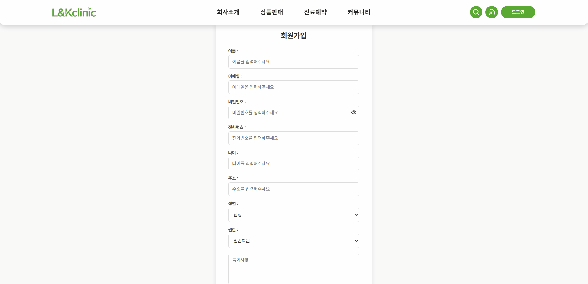
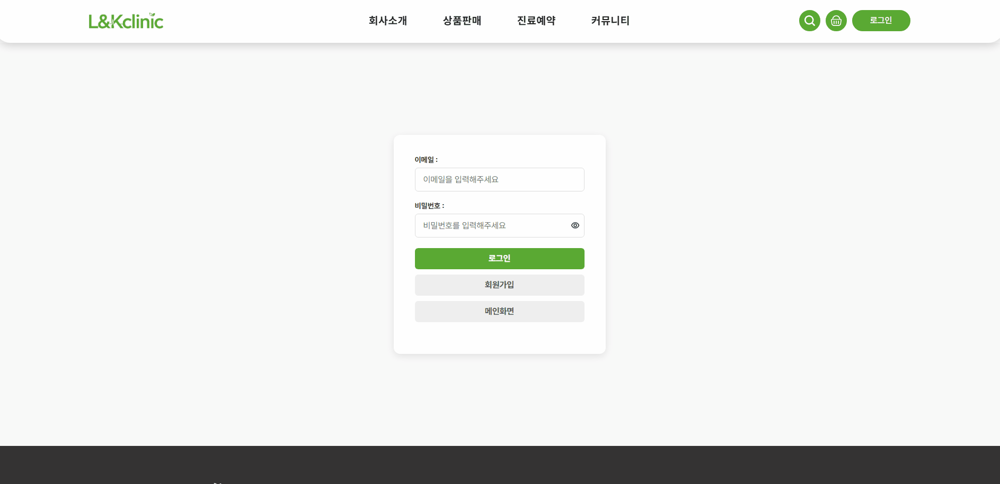
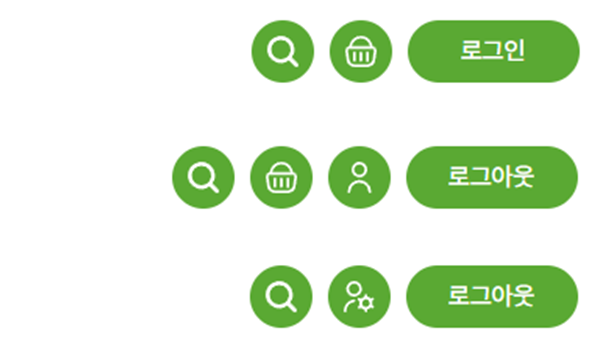

# L&Kclinic - 뷰티케어 상품 판매 및 시술상품 예약 주문 사이트

# 프로젝트 선정 배경

- 최근 k-컬쳐에 대한 관심이 높아지면서, k-뷰티 상품에 대한 관심 또한 높아지고 있습니다. 그에따라 뷰티 상품 구매, 시술 예약 등 뷰티 관련 사이트들 또한 증가하고 있지만, 시술 및 진료예약과 더불어 뷰티상품의 판매까지 하는 사이트는 많지 않기에 해당 사이트를 구현하고자 제작을 시도하게 되었습니다.

# 기획의도

1. 쉬운 예약 및 상품구매를 할 수 있도록 도움을 주는 장바구니, 구매를 위한 결제페이지, 구매한 상품을 확인 할 수 있도록 하는 마이페이지 등 이용하는 고객들이 직접 사용하는 서비스를 대상으로 제작.

2. 관리자 페이지에서는 이용하는 고객들을 확인하고 관리하는 회원관리 페이지, 상품 및 예약상품을 추가할 수 있는 상품, 예약관리 페이지, 구매한 상품을 확인할 수 있는 상품결제, 예약결제 페이지와 다양한 지점을 관리할 수 있는 지점 페이지, 고객과의 소통을 위한 공지사항 및 Q&A 페이지 제작

# 사용기술

# 팀원 & 담당 역할

| 팀원             | 역할                                                                                                                                                                                                                                   |
| ---------------- | -------------------------------------------------------------------------------------------------------------------------------------------------------------------------------------------------------------------------------------- |
| **김현우(팀장)** | • 메인, header, footer, 마이페이지   • 상품판매, 진료예약 리스트 페이지 제작   • 장바구니, 결제 페이지 제작   • 사용자 화면 전체 레이아웃, css 공통화   • GitHub 버전 관리 총괄                                            |
| **이선영**       | • 상품판매/진료예약 목록 및 상세 페이지   •상품/진료 아이템 구성 및 이미지 DB 구축  •사용자 후기(상세 페이지 내 기능, 마이페이지 내 링크)  •상품관리 페이지  •CSS 공통화 지원                                              |
|                  |
| **이용근**       | • 라우팅 설계   • 관리자 페이지 전체 구조 설계   • 관리자 회원관리, 상품결제관리,지점관리,공지사항,Q&A 제작   • 관리자 페이지 레이아웃, css공통화  • 전체 오류 검토 및 테스트 후 수정   • 카카오 API활용 지점별 맵 구현 |
| **이현성**       | • 로그인 / 회원가입   • 지점소개 페이지 제작   • 공지사항 및 자주묻는 질문 페이지 작업  • 관리자 예약관리 페이지 제작                                                                                                      |

---

# 메인화면

 

# 사용자페이지 주요기능

## **회원가입 / 로그인**

사용자 정보를 등록하고, 인증을 통해 로그인을 처리합니다.
 

회원가입 GIF

 

|  |
| :---------------------------:
| **회원가입** |

로그인 GIF

 

|  |
| :---------------------------:
| **회원가입** |

비로그인, 유저로그인, 관리자로그인에 따른 버튼 구별화

 

| |
| :---------------------------:
| **비로그인, 유저로그인, 관리자로그인에 따른 버튼 구별화** |

- 검색, 정렬, 필터, 페이징 기능 구현

- 예약상품 지점,날짜,시간 선택 기능(관리자페이지와 연동) 구현
- 예약상품 결재내역이나 장바구니에 있을 시 중복 예약 불가 기능 구현

- 주문상품, 예약상품 리뷰 기능 구현(상품 구매시에만 리뷰등록 가능)

- 주문, 예약 상품을 장바구니에 담기 기능 구현(각각의 db를 합침)
- 주문, 예약 상품을 한번에 결제하는 기능 구현(결제시 db를 타입별로 재분배)
- 자주묻는질문, q&a 글쓰기 및 수정 기능
- 내정보 수정기능 구현
- 나의 결재내역, 내가쓴 글, 내가쓴 리뷰 열람 기능

# 관리자페이지 주요기능

- 관리자 페이지 내 검색, 페이징, 메뉴별 정렬,필터 기능 구현
- 회원관리 - 회원 삭제, 추가 수정 기능 구현
- 상품관리 - 카테고리 별 추가,삭제,수정 기능 구현
- 예약관리 - 지점관리 메뉴와 연동된 예약지점 선택기능, 자유롭게 추가,삭제 가능한 예약시간 선택 기능, 카테고리별 추가, 삭제, 수정 기능 구현
- 상품결제관리 - 해당 주문 상태 변경기능(배송준비,배송완료), 상품 수정,삭제 기능 구현
- 상품결제관리 - 해당 주문 상태 변경기능(예약대기,예약확정), 상품 수정,삭제 기능 구현
- 지점관리 - 카카오 api를 활용한 지도,주소 입력 기능, 지점 추가,삭제시 지점소개 페이지에 실시간 반영기능 구현
- 공지사항 관리 - 글 작성 및 수정, 삭제기능 구현
- q&a 관리 - 유저의 작성글에 답변 기능, 답변시 상태변경 기능(답변대기,답변완료) 구현

# ---- 주의사항 ----

    inputSlice -> input ->

    isState = false 일때 로그인

    isState = true 일때 로그아웃

---

# 브랜치

dev = 공용 브랜치(테스트서버)

faithyg93 = 이용근

lhstk114 = 이현성

gusdn000615 = 김현우

snooze30 = 이선영

# 실행 방법

npm install @reduxjs/toolkit react-redux

npm install react-router-dom

npm install -g json-server

json-server --watch src/db/db.json --host 0.0.0.0 --port 3001

npm install axios

npm install @fullpage/react-fullpage -> 리액트 메인 풀페이지 라이브러리

npm i react-calendar -> 리액트 캘린더 추가 라이브러리

# 관리자계정

- ID : admin@naver.com
- PW : 1234
